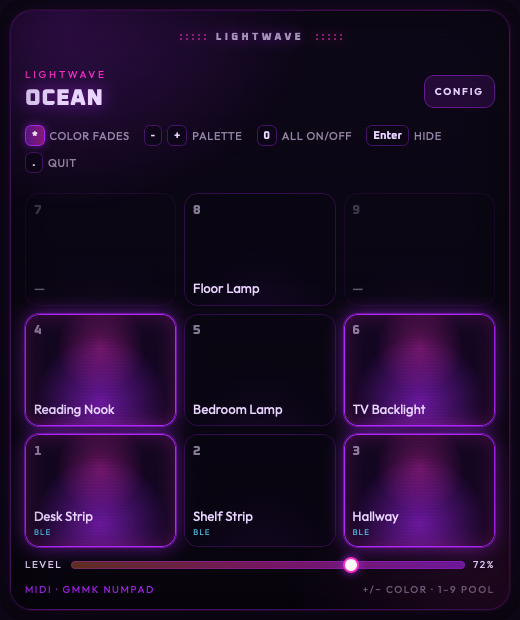
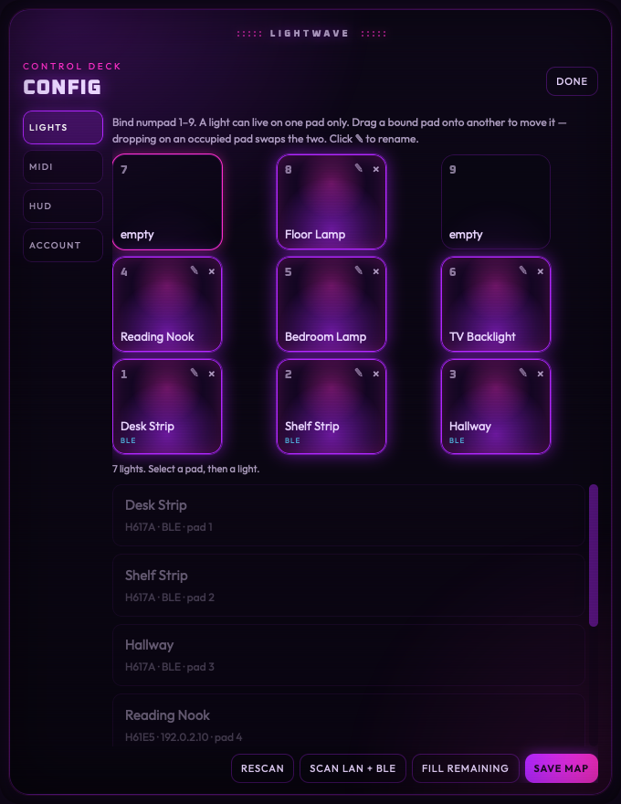
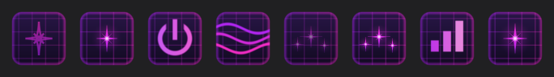
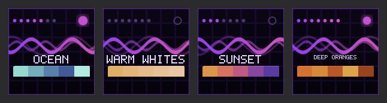

# Lightwave

**Instant, local control of your Govee lights — from a keypad, a dial, or a Stream Deck.**

Lightwave is a small macOS app that talks to Govee lights **directly on your own network and over Bluetooth**. No cloud round-trip when you turn a light on, no lag, and it keeps working when your internet is down. Turn a knob and the room responds immediately.



---

## Why this exists

The Govee app is fine for setting up a light and forgetting about it. It's less fine when you want to *use* your lights constantly — dimming while you work, killing everything when a movie starts, shifting the room warm in the evening. Reaching for your phone, waiting for a cloud request, and hunting through menus is too much friction for something you do thirty times a day.

Lightwave puts your lights on physical controls. A number key toggles a lamp. A slider dims everything at once. One key turns the whole room off. It's the difference between operating your lights and *playing* them.

**Local control means:**

- **Fast** — commands go straight to the light over your LAN or Bluetooth, typically in milliseconds
- **Private** — light commands never leave your network
- **Reliable** — works during an internet outage
- **Gentle on rate limits** — Govee's cloud API caps requests; local control has no such ceiling

The cloud is used for exactly one thing: reading your light *names* during setup, so your keys say "Bedroom Lamp" instead of "H6072."

---

## What you can do

| Control | What it does |
|---|---|
| **1–9** | Toggle that light on or off |
| **0** | Toggle every light — all off, or all back on |
| **Slider / dial** | Dim every lit light together, smoothly |
| **+ / −** | Cycle color palettes |
| **\*** | Start or stop a slow color fade across the room |
| **Enter** | Hide the window (it keeps running) |
| **.** | Quit |

Lights that are on glow on screen, so the window is a live map of the room. If you change a light in the Govee app or flip a physical switch, Lightwave notices and updates.

### Color palettes

Eight built-in palettes: Warm Whites, Soft Ambers, Deep Oranges, Reds, Purples, Ocean, Fall Leaves, and Sunset.

When several lights are on, they don't all get the same color — Lightwave spreads related shades across the group, so a room reads as *composed* rather than uniform. Press `*` and those colors drift slowly through the palette, each light offset from the next.

---

## Requirements

- **macOS 11 or later** (Apple Silicon or Intel)
- **Govee lights** — see [compatibility](#which-lights-work) below
- **A Govee API key** (free) for reading light names — [get one here](https://developer.govee.com/reference/apply-you-govee-api-key)
- Optionally: a MIDI keypad, a USB dial, or a Stream Deck

---

## Which lights work

Lightwave reaches lights two ways, and prefers whichever is faster.

### Wi-Fi (LAN control) — best

The fastest and most reliable path. Enable it per light in the Govee app: **Device Settings → LAN Control → on**.

Govee's officially LAN-capable models include **H6046, H6047, H6051, H6056, H6059, H6061, H6062, H6065, H6066, H6067, H6072, H6073, H6076, H6078, H6087, H6088, H610A, H610B, H6110, H6117, H6159, H615A, H615B, H615C, H615D, H6163, H6168, H6172, H6173, H6175, H6176, H618A, H618C, H618E, H618F, H619A, H619B, H619C, H619D, H619E, H619Z, H61A0, H61A1, H61A2, H61A3, H61A5, H61A8, H61B2, H61E1, H61E5, H6640, H6641, H7012, H7013, H7021, H7028, H7041, H7042, H7050, H7051, H7055, H705A, H705B, H705C, H7060, H7061, H7062, H7065, H7066, H7075, H70B1, H70C1, H70C2, H7099** — plus others Govee adds over time.

The list is a guide, not a wall: some models support LAN control without appearing on it. Lightwave discovers whatever answers on your network, so **try your light even if it isn't listed**.

📖 [Govee's official LAN API documentation](https://app-h5.govee.com/user-manual/wlan-guide)

### Bluetooth — the fallback

Lights with no LAN support are driven over Bluetooth LE instead. Lightwave finds any Govee light advertising nearby and controls power, brightness, and color. This covers many strips and bulbs Govee never exposed to LAN control, including **H617A** and similar RGBIC strips.

Bluetooth is slightly slower than Wi-Fi and needs the light in range of your Mac. When a light supports both, **Wi-Fi always wins**.

> **First launch:** macOS will ask for Bluetooth permission. Lightwave can't find Bluetooth lights without it.

### Which is my light using?

Look at the pad in the app. **BLE** means Bluetooth; an IP address means Wi-Fi; **no link** means it hasn't been found yet — check that the light is powered on, and that LAN Control is enabled in the Govee app.

---

## Setup

1. **Install and launch.** On first run, Lightwave opens its Config screen.
2. **Add your API key** in the **Account** tab (or put `GOVEE_API_KEY=...` in a `.env` file). This is only for reading light names.
3. **Enable LAN Control** on each supported light in the Govee app.
4. **Scan** with the **Scan LAN + BLE** button.
5. **Bind your lights.** Click a numbered pad, then a light. Repeat.
6. **Save map.**



Useful extras: **drag a pad onto another** to move or swap it, and click the **✎** on a pad to rename a light for yourself. Renames survive rescans.

---

## Using a keypad, knob, or dial

Lightwave listens to **any MIDI controller**. It's built around a numpad, but a knob box, a DJ controller, or a MIDI foot pedal works just as well — anything that sends MIDI over USB.

### The quick path: auto-learn

Lightwave learns your dial automatically. Open the app, **turn the knob back and forth a few times**, and it will adopt it for brightness.

The rule it uses: a control that reports *more than one distinct value* is a real dial; one that always sends the same number is a button. That distinction matters, and it's the source of the most common problem below.

### Doing it manually

If auto-learn picks the wrong control, set it explicitly in **Config → MIDI**:

| Setting | What it controls |
|---|---|
| Brightness CC | The dial or fader that dims your lights |
| Alternate CC | A second dial, if you have one |
| Color + / − note | Buttons that cycle palettes |

To find your controller's numbers, use a free MIDI monitor ([MIDI Monitor](https://www.snoize.com/midimonitor/) on macOS), turn the knob, and read the **CC number** it reports.

### Known-good controllers

Anything class-compliant over USB works. Common choices:

- **[GMMK Numpad](https://www.gloriousgaming.com/products/gmmk-numpad)** — a numpad with a fader; the layout Lightwave was designed around
- **Korg nanoKONTROL2** — eight faders and knobs, great for per-room dimming
- **Behringer X-Touch Mini** — eight rotary encoders plus buttons
- **Akai MIDImix / LPD8** — plenty of knobs and pads
- Any MIDI keyboard with a mod wheel or assignable knob

### ⚠️ If your dial doesn't do anything

**The most common cause isn't Lightwave — it's the controller's own firmware.**

Many keypads (the GMMK Numpad included) ship with the fader mapped as a *button* rather than a continuous control, so it sends the same value forever no matter where you move it. Lightwave deliberately ignores such a control, because acting on it would jam brightness at one value and fight every other input.

**The fix is in your controller's configuration software** — [VIA](https://usevia.app/) for QMK keyboards, or the vendor's editor:

1. Open the configurator and select your device
2. Find the fader or knob in the key map
3. Set it to send a **MIDI CC (Control Change)** with an **absolute/continuous** value — not a button, note, or key press
4. Save to the device
5. Restart Lightwave and turn the knob

In a MIDI monitor, a correctly configured dial shows values *sweeping* across 0–127. If you only ever see one number, it's still bound as a button.

---

## Stream Deck plugin

Lightwave ships an Elgato Stream Deck plugin, so your lights live on the deck alongside everything else.



| Action | What it does |
|---|---|
| **Status** | Live display: palette name, its actual colors, fade state, and how many lights are on |
| **Light** | Toggle one light; the key shows its name and lights up when on |
| **All Lights** | Everything off — or back on when all are off |
| **Brightness** | Nudge up or down; on **Stream Deck +**, turn the dial |
| **Palette** | Cycle color palettes |
| **Color Fade** | Start or stop the slow fade |

### The Status key

A live, animated readout of your lighting, drawn in the Lightwave style — neon waves over a dark grid, with the palette's real colors along the bottom:



- **Palette name and swatches** — the exact colors currently in play
- **Pips, top-left** — one per bound light, lit when that light is on
- **Dot, top-right** — glowing and pulsing while the color fade runs, a hollow ring when idle
- **The wave** drifts gently, and speeds up while the fade is running

Press it to cycle palettes.

### Install

```bash
./streamdeck/build.sh --install
```

Then open Stream Deck and drag **Lightwave** actions onto your keys. A ready-made two-page layout is included — open `streamdeck/Lightwave.streamDeckProfile` to import it, then set which light each key controls.

**Stream Deck keys stay in sync.** Turn a light off from the app, the numpad, or the Govee app, and the key updates. Lightwave must be running; the plugin reconnects on its own if you restart it.

---

## Everything talks to everything

Every control drives the same shared state, so nothing gets out of step:

```
  Keypad / dial  ─┐
  Stream Deck    ─┼──►  Lightwave  ──┬──►  Wi-Fi (LAN)  ──►  your lights
  The app window ─┘                  └──►  Bluetooth    ──┘
```

Dim with the knob and the on-screen slider moves. Toggle a light on the deck and the app's pad lights up.

---

## Troubleshooting

**No lights found.** Enable LAN Control in the Govee app, confirm your Mac is on the same network as the lights, then **Scan LAN + BLE**. If your lights are on a guest network or separate VLAN, move them to the same subnet as your Mac — network isolation blocks local discovery.

**A light shows "no link."** It's known from your Govee account but hasn't answered locally. Check that it's powered on and in Bluetooth range, or enable LAN Control.

**Bluetooth lights don't appear.** Confirm macOS Bluetooth permission was granted (**System Settings → Privacy & Security → Bluetooth**). Bluetooth range is much shorter than Wi-Fi.

**Names show as model numbers** (like "H6072"). Add your Govee API key in the **Account** tab and rescan. Lights not registered in your Govee account have no name to fetch — rename them yourself with the **✎** button.

**The dial does nothing.** See [the warning above](#️-if-your-dial-doesnt-do-anything) — it's almost always the controller's firmware mapping.

**Stream Deck keys say "offline."** Lightwave isn't running. Start it; the keys recover automatically.

---

## Privacy

Lightwave runs entirely on your machine. Light commands go directly to your lights over your own network or Bluetooth — never through a server. Your Govee API key is stored locally and used only to fetch device names.

---

## Building from source

Go, Node, and [Wails](https://github.com/wailsapp/wails) required:

```bash
./scripts/build.sh              # the app
./streamdeck/build.sh --install # the Stream Deck plugin
```

Architecture, the local protocols, and development notes are in [docs/DEVELOPING.md](docs/DEVELOPING.md).

---

## License

MIT — see [LICENSE](LICENSE).

Lightwave is an independent project. It is not affiliated with, endorsed by, or supported by Govee or Elgato. Govee and Elgato are trademarks of their respective owners.
