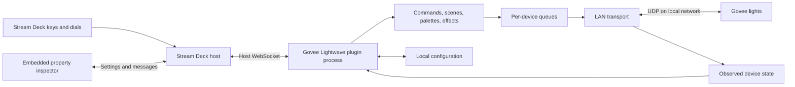

# Technical design

## Runtime decision

Use a self-contained Go plugin executable plus bundled HTML/CSS/JavaScript property inspectors. This preserves useful Go rendering and color logic while avoiding a companion process, HTTP server, and Wails frontend. Go is the proposed baseline; the first packaging spike must prove current Stream Deck protocol and Marketplace protection compatibility.



The local executable is unavoidable plugin logic, but it is launched and managed by Stream Deck. There is no separately deployed backend or separately launched frontend. Closing an inspector does not interrupt control. Quitting Stream Deck stops plugin networking and effects.

## Independent folder and identity

Future implementation layout, not directories or executable files created by this plan:

```text
govee-lightwave/
  README.md, PRODUCT.md, ARCHITECTURE.md, DELIVERY.md
  plugin/
    go.mod
    cmd/govee-lightwave/
    internal/{streamdeck,lan,devices,commands,scenes,color,render,store}/
  com.dinksf.govee-lightwave.sdPlugin/
    manifest.json
    bin/                         # Packaged platform binaries
    ui/                          # Inspector and shared editors
    imgs/                        # Key, action-list, and product icons
    layouts/                     # Dial feedback
    profiles/                    # Bindable starter layouts
  scripts/                       # Isolated build/validate/package tooling
  tests/fixtures/
  docs/compatibility.md
  THIRD_PARTY_NOTICES
```

Provisional UUID: `com.dinksf.govee-lightwave`, derived from the current repository namespace, pending confirmation of publisher identity. Actions append `.power`, `.brightness`, `.color`, `.temperature`, `.palette`, `.scene`, `.fade`, `.sweep`, and `.status`. Freeze identifiers before release. Do not reuse the existing plugin’s UUIDs or install paths.

Use a separate Go module with no imports, build-time replacements, symlinks, or runtime calls into the parent desktop app. Copy and adapt selected source with provenance and notices. Keep all new build products within this folder. The new plugin must build from an export of this folder alone.

## Reuse map and findings

| Existing source | Decision |
|---|---|
| `streamdeck/plugin/internal/render/` | Adapt wave/grid, typography, swatches, and rails to generic device/room state |
| `internal/color/engine.go` and tests | Reuse palette values, interpolation, and distribution; remove desktop-specific assumptions |
| `internal/govee/udp.go` | Extract basic discovery/control patterns; split transport from BLE and model effects |
| `streamdeck/plugin/internal/sd/conn.go` | Audit WebSocket framing, lifecycle, concurrency, and SDK 3 events before reuse |
| `streamdeck/plugin/main.go` | Reuse selected action/render concepts and sweep semantics; replace pad targeting and daemon calls |
| Existing inspector files | Reference current controls; build shared device/room/scene editing for the new product |
| `streamdeck/plugin/internal/lw/client.go` | Exclude: this is the desktop daemon dependency |
| `internal/govee/model.go` | Do not adopt broad model-prefix capability guesses as verified support |
| Wails, IPC, web server, BLE, MIDI, cloud name lookup | Exclude from standalone module |

Repository evidence: existing plugin uses a Unix socket named `lightwave.sock`; existing manifest uses SDK 2 and Stream Deck 6.4 minimum. The UDP receiver currently binds port 4002 and parses power/brightness status. Color/temperature readback needs separate verification and implementation. The repository README’s gradient limitations differ from newer code paths, so documentation alone cannot establish functionality.

## LAN and command engine

Protocol baseline from the current source: IPv4 multicast discovery at `239.255.255.250:4001`, replies on UDP 4002, commands to device UDP 4003. Inspect the official Govee guide interactively and verify packet captures before freezing payloads; automated retrieval of its dynamic page did not expose the specification during planning.

One shared listener per plugin process, not per action. Discover on eligible active interfaces, support explicit interface selection, and reopen subscriptions after network changes and wake. Associate a stable Govee device identifier with its current address; validate packets and handle identifier/address collisions explicitly.

Manual addresses must be local IPv4 unicast destinations and must pass a targeted identity/status handshake before enrollment. Bound packet sizes, validate JSON and numeric ranges, reject unexpected command types, and avoid scanning arbitrary subnets. Do not trust an advertised packet address without checking the sender and local route. Govee LAN messaging is not treated as an authenticated trust boundary.

Detect port conflicts and show “Another lighting controller is using the discovery port.” The old plugin may coexist in Stream Deck, but simultaneous discovery with the desktop application or another Govee controller is not guaranteed. Do not silently stop other applications or promise socket sharing across operating systems.

Use per-device queues with coalescing for rapid brightness/color changes, bounded retries and backoff, and a global traffic budget. Start hardware tuning at a maximum of five light-changing packets per device per second, including retry traffic; this is a conservative engineering hypothesis, not a Govee limit. Poll status separately on a budget. Power-off cancels queued effects and wins over stale color work.

A UDP send is not confirmation. Maintain requested state separately from observed state, annotate pending values, query status after writes, and settle to confirmed, mismatched, or unavailable. Associate local command generations with pending work so obsolete retries cannot override newer input. Protocol replies without request IDs cannot provide perfect ordering; reconcile conservatively.

Proposed starting timing: visible targets poll every 2 seconds, other managed lights every 10 seconds, stale after 15 seconds without a valid reply. Tune against the 20-device test target and packet-loss testing. After reconnect, refresh observations; discard queued historical scene and power changes.

Groups fan out commands and report partial results, not atomic success. Multi Actions must return promptly while tracking completion. Serialize conflicting operations per device. Sweep follows saved room order, paces steps, and reanchors to observed state after idle. Effects use a monotonic clock and never run independently per visible key instance.

## Data and settings

| Entity | Essential fields |
|---|---|
| Device | Stable ID, SKU, local alias, current address, interface, last-seen, capability evidence |
| Observed state | Power, brightness, RGB/temperature when available, timestamps and uncertainty per field |
| Room | Stable UUID, name, ordered device IDs |
| Scene | Stable UUID, name, explicit per-device desired fields, optional transition, schema version |
| Action settings | Target type/ID, operation, value/step, appearance, schema version |
| Runtime effect | Device ownership, palette, phase, speed; transient by default |

Persist device aliases, rooms, and scenes in a versioned application-data store unique to Govee Lightwave; use atomic replacement and last-good backup. Keep observed state transient or explicitly marked stale on load. Store per-action references in Stream Deck action settings. Keep preferences in one canonical store; route all inspector writes through the runtime to avoid conflicting editors.

Packaged files are immutable. Never write configuration inside the `.sdPlugin` assets or read the protected manifest at runtime. Export/import uses a versioned JSON document with validation, duplicate-ID handling, and explicit device rebinding; do not assume profiles carry the shared registry between computers.

Logs are local, rotated, and bounded. Diagnostics export excludes raw device IDs and addresses by default; users can opt into fuller detail. No telemetry or cloud connection is planned. Persist no Govee credentials.

## Packaging targets

Propose Windows 11 x64 and macOS 13+ on Intel/Apple Silicon, subject to the packaged-binary and host test matrix. Do not list untested Windows ARM support. Start with SDKVersion 3 and Stream Deck minimum 6.9 for Marketplace DRM compatibility, raising the minimum only when actual features require it. Elgato documents protection support for Go as well as other SDK languages. [Distribution reference](https://docs.elgato.com/streamdeck/sdk/introduction/distribution/)

Validate architecture selection, host launch arguments, inspector messaging, key and encoder lifecycles, reconnect, and shutdown. Use the official CLI to validate and pack. Exercise the Maker Console processed package as well as the local installer, including installation, update, and offline behavior. Record signing/notarization and local-network/firewall behavior from clean-machine tests rather than assuming development binaries represent the customer experience.
